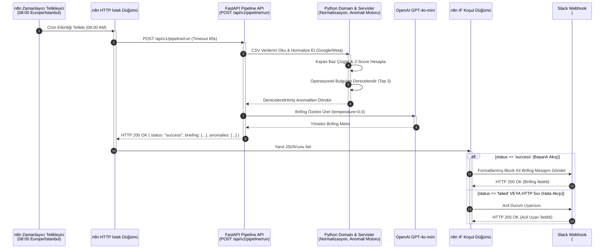
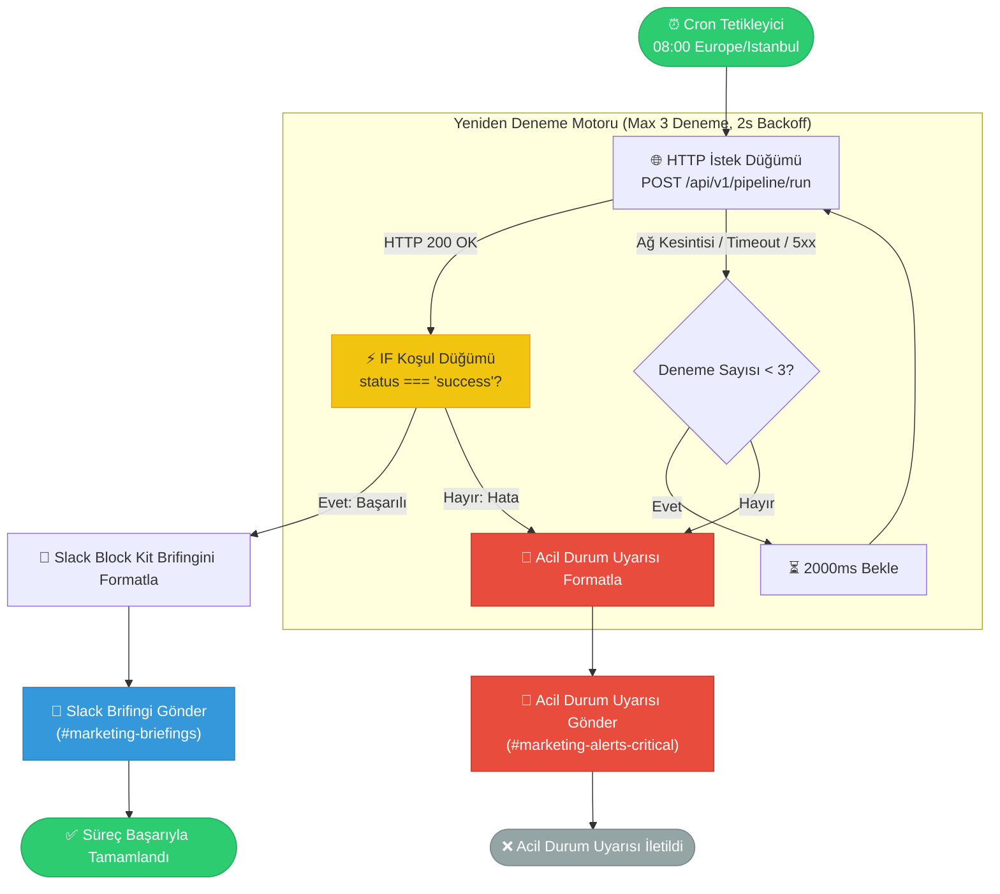

# Görsel Mimari & Akış Diyagramları — Sabah Brifingi Pipeline'ı

Bu doküman, n8n Sabah Brifingi ve Anomali Uyarı Otomasyon Pipeline'ının Mermaid.js diyagramları ile hazırlanmış görsel mimari ve akış şemalarını sunar.

---

## 1. Uçtan Uca Sıralama Diyagramı (Sequence Diagram)

Aşağıdaki sıralama diyagramı; n8n Zamanlayıcısı (Cron Trigger), FastAPI Uygulaması, Dahili Domain Servisleri, OpenAI LLM Servisi ve Slack Webhook uç noktaları arasındaki etkileşim akışını detaylandırır.

---

## 2. Akış Şeması ve Yeniden Deneme (Retry) Mantığı

Aşağıdaki akış şeması; düğüm karar ağacını, koşul değerlendirmesini ve katlanarak artan bekleme süreli (exponential backoff) yeniden deneme politikasını görselleştirir.

